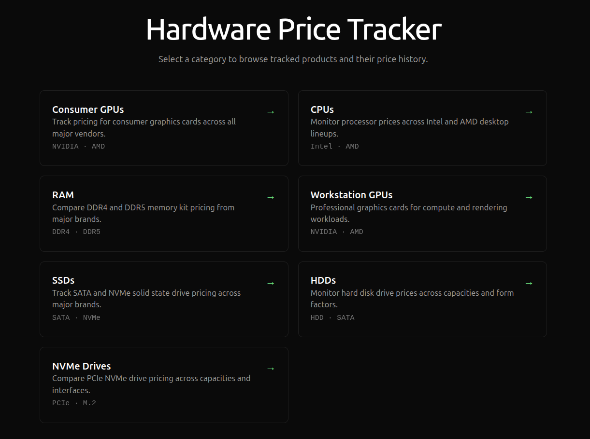
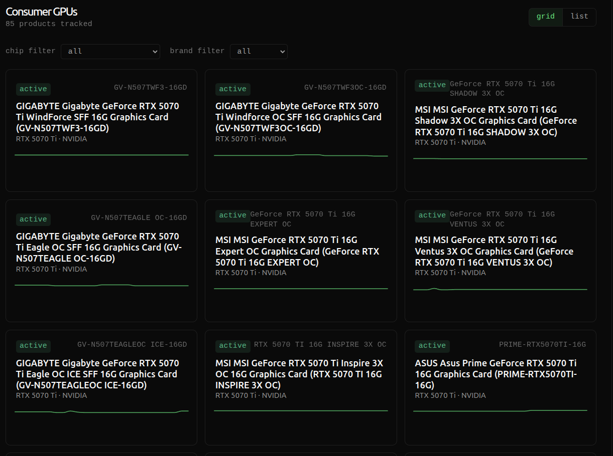
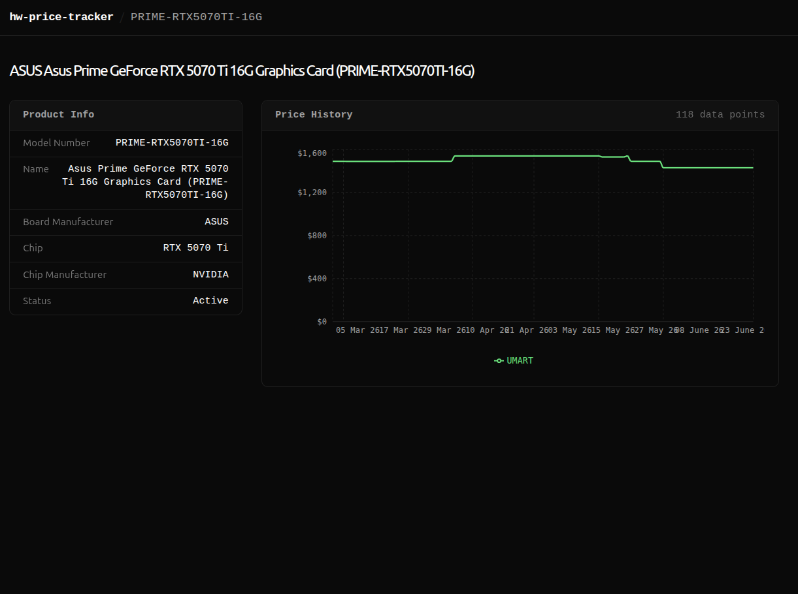

# Hardware Price Tracker (Frontend)

A multi-page interface for tracking the price history of computer hardware components across online retailers. Built with React 19, TypeScript, and Recharts, it interfaces with a Spring Boot REST API that scrapes vendor pricing data on a daily schedule.

> This repository covers the **frontend only**. The backend (Spring Boot + PostgreSQL) has its own README.

---

## Overview

This application allows users to browse time-series pricing data on computer hardware across several categories — Consumer GPUs, CPUs, RAM, Workstation GPUs, SSDs, HDDs, and NVMe drives — and view interactive charts for each product, broken down by vendor. The goal is to give users a clear picture of how prices move over time across the Australian market, with the intention to extend coverage to US vendors in the future. The application was created in response to the extreme pricing volatility within the PC market.

---

## Key Features

- **Category browsing** — Landing page with seven hardware categories, each linking to a list of products
- **Dual view modes** — Products can be browsed in grid or list layout
- **Chip & brand filters for GPUs** — Filter consumer GPUs by chip model and board manufacturer
- **Product detail pages** — Per-product specification tables with full price history
- **Multi-vendor price charts** — Interactive line charts showing price over time, one line per vendor, powered by Recharts
- **Smart price deduplication** — Where multiple price points exist for the same vendor on the same day, only the latest is plotted
- **Active/inactive status** — Products are flagged as active or discontinued; active products sort to the top
- **Breadcrumb navigation** — Context-aware navbar that reflects the current category and product
- **Responsive layout** — Mobile-friendly using Tailwind CSS utility classes
- **High-contrast dark theme** — Fixed black background with bright green accent via CSS custom properties

---

## Tech Stack

| Layer | Technology |
|---|---|
| Framework | React 19 |
| Language | TypeScript 5.9 (strict mode) |
| Build tool | Vite 8 |
| Routing | React Router v7 |
| Styling | Tailwind CSS v4 |
| Data visualisation | Recharts 3 |
| Linting | ESLint 9 + typescript-eslint (strict) |

---

## Project Structure

```
src/
├── components/               # Reusable UI components
│   ├── Navbar.tsx            # Sticky header with breadcrumb navigation
│   └── PriceChart.tsx        # Multi-vendor line chart (Recharts)
├── pages/                    # Route-level page components
│   ├── LandingPage.tsx       # Category selection home page
│   ├── ProductListPage.tsx   # Browsable product grid / list
│   └── ProductDetailPage.tsx # Product specs + price history
├── services/                 # API integration layer
│   ├── product_services/     # Fetch product catalogues (GPU, CPU, RAM, Workstation GPU, SSD, HDD, NVMe)
│   └── price_point_services/ # Fetch price history per product
├── types/                    # TypeScript interfaces
│   ├── product_types/        # Product data models
│   ├── price_point_types/    # Price point data models
│   └── hybrid_types/         # Combined product + price responses
├── App.tsx                   # Route definitions
└── main.tsx                  # Application entry point
```

The service layer mirrors the backend's REST structure. Each hardware category has a dedicated product service and a price point service, keeping data-fetching logic isolated from UI components.

---

## Backend Integration

The frontend proxies all API calls through Vite's dev server to the Spring Boot backend running on `http://localhost:8080`.

**Endpoints consumed:**

| Method | Endpoint | Description |
|---|---|---|
| `GET` | `/api/gpus` | All consumer GPU products |
| `GET` | `/api/cpus` | All CPU products |
| `GET` | `/api/ram` | All RAM products |
| `GET` | `/api/workstation_gpus` | All workstation GPU products |
| `GET` | `/api/ssds` | All SSD products |
| `GET` | `/api/hdds` | All HDD products |
| `GET` | `/api/nvmes` | All NVMe drive products |
| `GET` | `/api/gpu_pricepoints/{modelNumber}` | GPU specs + full price history |
| `GET` | `/api/cpu_pricepoints/{modelNumber}` | CPU specs + full price history |
| `GET` | `/api/ram_pricepoints/{modelNumber}` | RAM specs + full price history |
| `GET` | `/api/workstation_gpu_pricepoints/{modelNumber}` | Workstation GPU specs + price history |
| `GET` | `/api/ssd_pricepoints/{modelNumber}` | SSD specs + full price history |
| `GET` | `/api/hdd_pricepoints/{modelNumber}` | HDD specs + full price history |
| `GET` | `/api/nvme_pricepoints/{modelNumber}` | NVMe drive specs + full price history |

Price data is collected by a **JSoup web scraper** running on a **daily CRON schedule** in the backend, sourcing prices from Australian online retailers including Umart Online.

---

## Screenshots

### Landing Page



### Product List Page



### Product Detail Page



---

## Getting Started

**Prerequisites:** Node.js 18+, and the backend API running on port `8080`.

```bash
# Install dependencies
npm install

# Start the development server (http://localhost:3000)
npm run dev

# Type-check and build for production
npm run build

# Lint the codebase
npm run lint
```

---

## Roadmap

- [X] Type-filter for consumer GPUs
- [X] Brand-filter for consumer GPUs
- [X] HDD and SSD product categories
- [ ] Scorptec vendor tracking
- [ ] PCCG vendor tracking
- [ ] Pricing alert system to notify users of flash sales
- [ ] Hosted deployment (likely Oracle Cloud or AWS Lightsail)
